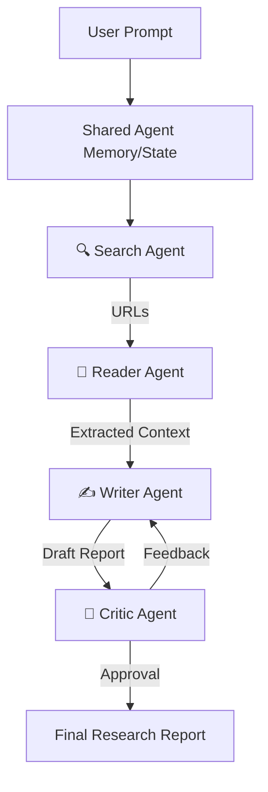

# 🤖 Agentic Scholar

[](https://opensource.org/licenses/MIT)
[](https://www.python.org/downloads/)
[](https://python.langchain.com/)

A fully autonomous AI system where multiple specialized Large Language Model (LLM) agents collaborate to conduct deep research and produce professional, comprehensive reports on any given topic.

Instead of relying on a single conversational model, this project employs a multi-agent architecture where agents with distinct roles—Searching, Reading, Writing, and Critiquing—work in tandem, sharing a unified memory space to synthesize high-quality intelligence.

---

## 🌟 Key Features

*   **🔍 Search Agent**: Autonomously browses the live internet to discover the most relevant, credible, and up-to-date sources for the requested topic.
*   **📖 Reader Agent**: Dives deep into the identified sources, intelligently scraping, filtering, and extracting meaningful content while ignoring noise.
*   **✍️ Writer Agent**: Synthesizes the gathered intelligence into a well-structured, detailed, and highly readable professional report.
*   **🧐 Critic Agent**: Acts as a senior researcher, reviewing the Writer's draft, scoring it against quality metrics, and providing actionable feedback for iterative improvement.
*   **🧠 Shared Memory System**: Agents are orchestrated via a shared state, ensuring seamless context handover and preventing information loss during the research pipeline.

## 🛠️ Tech Stack

*   **Core Framework**: [LangChain](https://python.langchain.com/) & LangGraph (for multi-agent orchestration)
*   **Language Models**: Support for OpenAI GPT-4o / Google Gemini models
*   **Pipeline Architecture**: LangChain Expression Language (LCEL)
*   **Web Search Integration**: Tavily API / DuckDuckGo Search
*   **Web Scraping**: BeautifulSoup4 / Playwright (for dynamic content)
*   **Vector Database (Optional)**: ChromaDB / FAISS for semantic caching

## 🏗️ Architecture



## 🚀 Getting Started

*(Codebase is currently under active development. Complete setup instructions and the main orchestration loop will be pushed shortly.)*

### Prerequisites
*   Python 3.10+
*   OpenAI / Anthropic / Gemini API Key
*   Tavily Search API Key

### Installation

1. Clone the repository:
   ```bash
   git clone https://github.com/VanshKardam/Agentic-Scholar.git
   cd Agentic-Scholar
   ```
2. Install dependencies:
   ```bash
   pip install -r requirements.txt
   ```
3. Set up environment variables:
   ```bash
   cp .env.example .env
   # Add your API keys to the .env file
   ```

## 🎯 Current Status & Roadmap

This project is in its initial setup phase. Over the coming weeks, the following milestones will be completed:
- [ ] Initialize LCEL pipelines and shared memory state schemas.
- [ ] Implement the `Search` and `Reader` toolsets.
- [ ] Develop the iterative `Writer` and `Critic` feedback loop using LangGraph.
- [ ] Add support for generating reports in multiple formats (Markdown, PDF).
- [ ] Build a simple Streamlit/Gradio UI for easier interaction.

## 🤝 Contributing

Contributions, issues, and feature requests are welcome! Feel free to check the [issues page](https://github.com/VanshKardam/Agentic-Scholar/issues).

## 📝 License

This project is licensed under the MIT License - see the [LICENSE](LICENSE) file for details.
